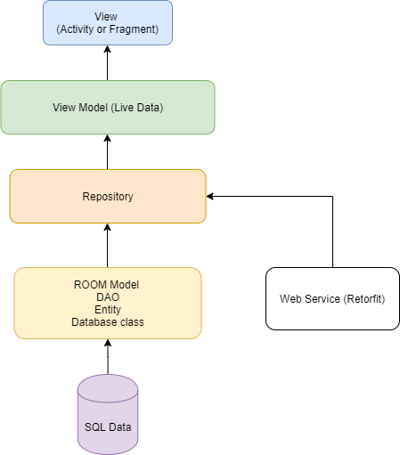
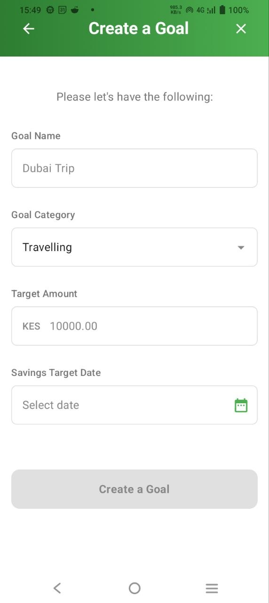
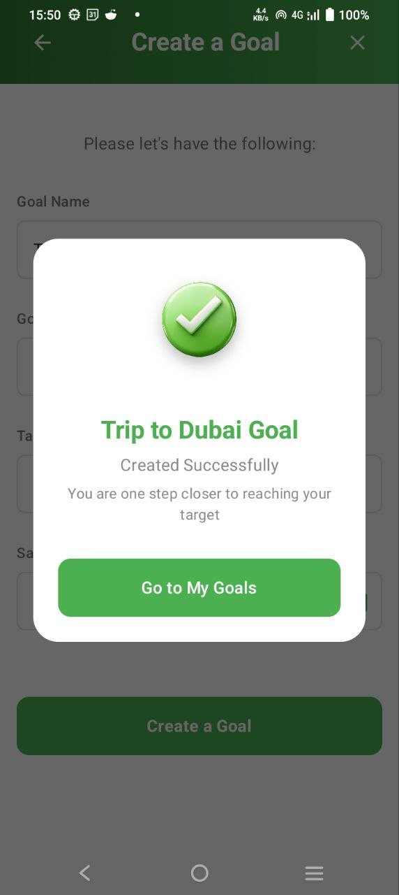
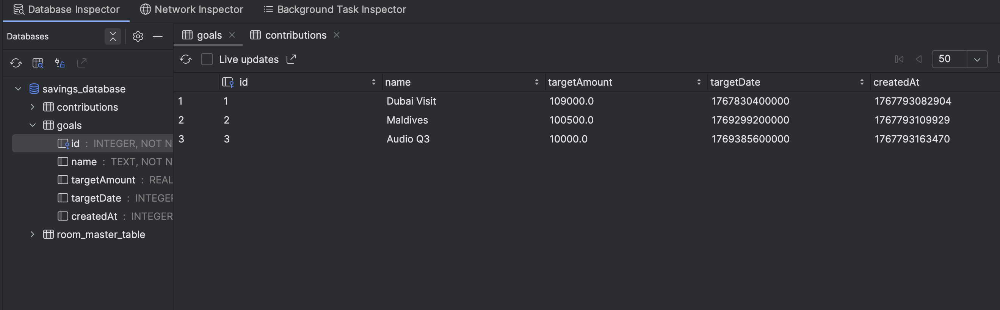

# My Akiba Benki

My Akiba Benki is an Android application that helps users create savings goals and track their progress over time.

## 📐Architecture
My Akiba Benki is built with the Model-View-ViewModel (MVVM) architecture with Repository pattern which is used to separate the app's user interface, logic, and data.

- **Model**: Represents the data and the business logic of the app. ~ It's the actual data and data sources, like databases or network requests.
- **View**: Represents the UI of the app. In your app, it would be the Jetpack Compose components that display the Savings goals data to the user.
- **ViewModel**: It holds the data that the View needs, exposing this data through StateFlow.
- **Repository**: This is an additional layer between the ViewModel and the data source. The Repository will handle data retrieval, whether it's from the API, local database, or other sources.

~ In essence, this architecture ensures a separation of concerns, promoting a more scalable and maintainable codebase. It decouples the UI from the data and business logic, allowing each component to evolve independently as shown below.

## 🛠 Tech Stack & Tools Used
- [Kotlin](https://developer.android.com/kotlin) - Most of the Android community uses Kotlin as their preferred choice of language.
- Jetpack:
    - [Jetpack Compose](https://developer.android.com/jetpack/compose) - Jetpack Compose is Android’s modern toolkit for building native UI. It simplifies and accelerates UI development on Android. Quickly bring your app to life with less code, powerful tools, and intuitive Kotlin APIs.
    - [Android KTX](https://developer.android.com/kotlin/ktx.html) - Android KTX is a set of Kotlin extensions that are included with Android Jetpack and other Android libraries. KTX extensions provide concise, idiomatic Kotlin to Jetpack, Android platform, and other APIs.
    - [AndroidX](https://developer.android.com/jetpack/androidx) - The androidx namespace comprises the Android Jetpack libraries. It's a major improvement to the original Android [Support Library](https://developer.android.com/topic/libraries/support-library/index), which is no longer maintained.
    - [Lifecycle](https://developer.android.com/topic/libraries/architecture/lifecycle) - Lifecycle-aware components perform actions in response to a change in the lifecycle status of another component, such as activities and fragments. These components help you produce better-organized, and often lighter-weight code, that is easier to maintain.
    - [ViewModel](https://developer.android.com/topic/libraries/architecture/viewmodel) - The ViewModel class is a business logic or screen level state holder. It exposes state to the UI and encapsulates related business logic. Its principal advantage is that it caches state and persists it through configuration changes.
- [Hilt for DI](https://developer.android.com/training/dependency-injection/hilt-android) - A dependency injection library for Android that reduces the boilerplate of doing manual dependency injection in your project.
- [Kotlin Coroutines](https://developer.android.com/kotlin/coroutines) - A concurrency design pattern that you can use on Android to simplify code that executes asynchronously and it's the recommended way for asynchronous programming on Android.
- [Kotlin Flow](https://developer.android.com/kotlin/flow) - In coroutines, a flow is a type that can emit multiple values sequentially, as opposed to suspend functions that return only a single value.
- [Logging Interceptor](https://github.com/square/okhttp/blob/master/okhttp-logging-interceptor/README.md) - An OkHttp interceptor which logs HTTP request and response data.
- [Mockk](https://github.com/mockk/mockk)- A mocking library for Kotlin
- [Junit5](https://github.com/mannodermaus/android-junit5)-A Gradle plugin that allows for the execution of JUnit 5 tests in Android environments using Android Gradle Plugin 8.0.0 or later.
- [Room](https://developer.android.com/jetpack/androidx/releases/room)- The Room persistence library provides an abstraction layer over SQLite to allow for more robust database access while harnessing the full power of SQLite.

## 📱 Screenshots

### Home Screen

### Create Goal Screen

### Goal Created Success Dialog

## Database Inspection

## Setting the Project Locally

- Git clone (https://github.com/josphatmwania/MyAkibaBank)
- Use _Java 17_ and above
- Use Android Studio IDE Koala Feature Drop and above.

#### License

MIT  [LICENSE](LICENSE) Josphat Mwania 2026
